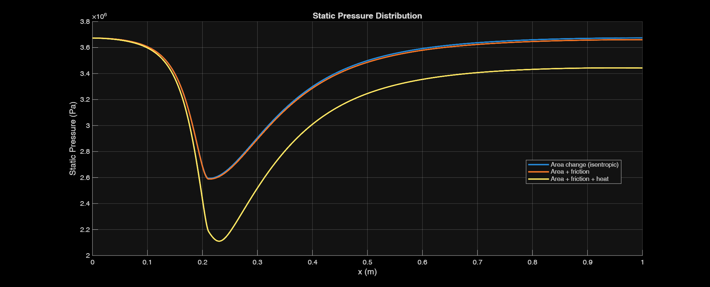
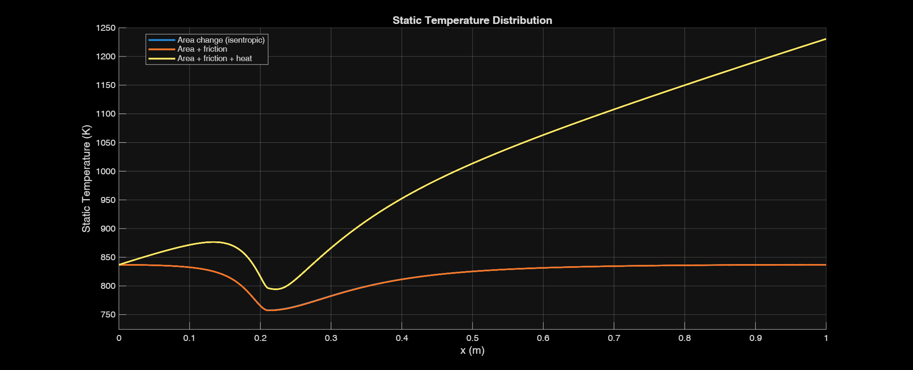
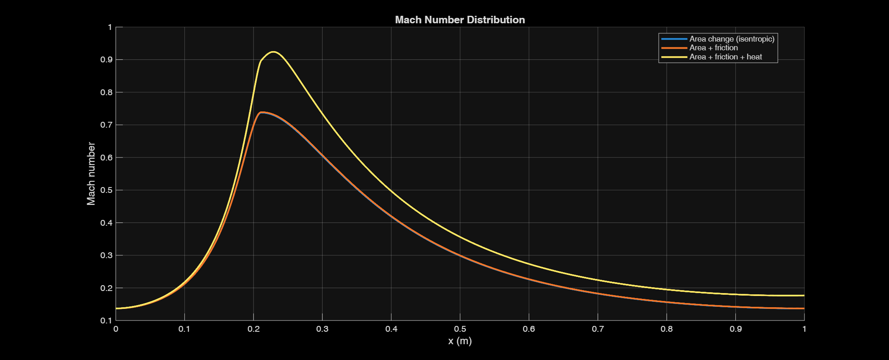
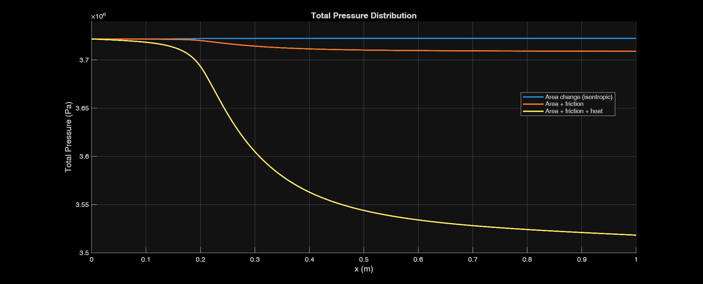

# simulation-of-1D-compressible-flow
MATLAB simulation of 1D compressible flow in a convergent–divergent nozzle (Gas Dynamics course project, 2nd-year Aerospace Engineering)
This project simulates **1D compressible flow** through a nozzle using MATLAB, considering:
- Area change (isentropic flow)
- Area + friction (Fanno flow)
- Area + friction + heat addition (Rayleigh flow)
- 
It visualizes parameters such as Mach number, static/dynamic/total pressure, temperature, density, and speed of sound.
---
## 📂 Project Structure

```
simulation_of_1D_compressible_flow.m   # Main MATLAB script
README.md                              # Project documentation
/results/                              # Folder to store generated figures
```
## ⚙️ How to Run
1. Open MATLAB.
2. Run the script: ```matlab simulation_of_1D_compressible_flow  ```
3. The script will generate and save plots in the `results/` folder.

---
## 📊 Plots Generated
- Static Pressure vs. x  
- Static Temperature vs. x  
- Static Density vs. x  
- Total Pressure vs. x  
- Total Temperature vs. x  
- Mach Number vs. x  
- Speed of Sound vs. x  

---

## 🖼️ Figures Preview
  
  
  
  

---
